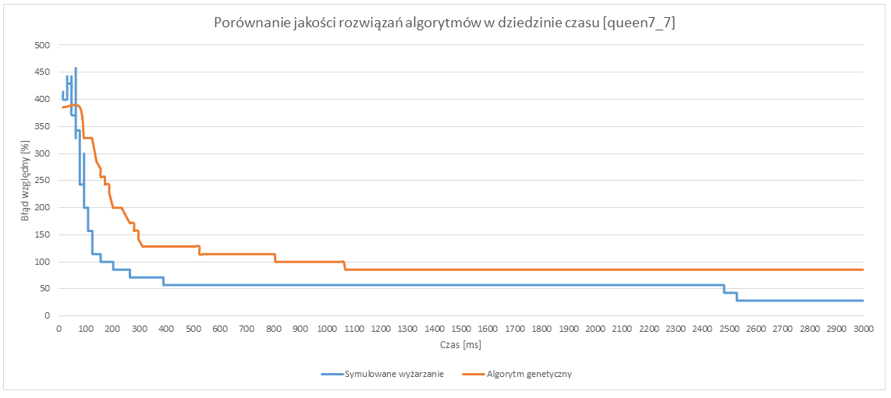

# graph-coloring-simmulated-annealing

## Performance tests

### Instance 
queen7_7.col (49,476), 7, SGB from https://mat.tepper.cmu.edu/COLOR/instances.html
le450_15b.col (450,8169), 15, LEI from https://mat.tepper.cmu.edu/COLOR/instances.html

### Charts

